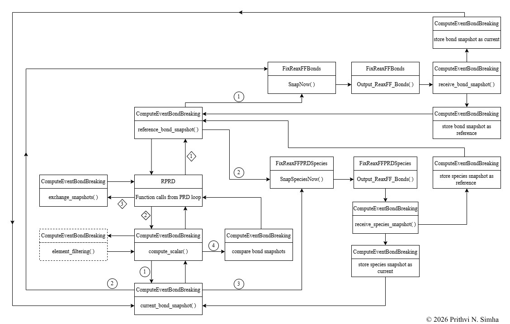

# LAMMPS Framework for Large-Scale Parallel Replica Dynamics Simulations of Ablative Thermal Protection Material

**Master's Thesis — TU Munich, Chair of Thermodynamics**

A custom extension of the [LAMMPS](https://www.lammps.org/) molecular dynamics framework implementing a **bond-connectivity-based event detection algorithm for Parallel Replica Dynamics (PRD)**, enabling reactive molecular dynamics simulations of ablative thermal protection materials to reach timescales far beyond the limits of conventional MD.

> The implementation is part of ongoing research at TUM and the source code is not public. This repository documents the motivation, methodology, and validation outcomes.

---

## The Problem

Vehicles in hypersonic flight rely on ablative thermal protection systems (TPS), whose decomposition is a thermo-chemo-mechanical process spanning length scales from centimeters down to nanometers. Modeling it correctly requires atomistic insight from reactive molecular dynamics. Reactive MD, however, is doubly constrained: the femtosecond timestep limits simulations to nanoseconds, and reactive potentials make each timestep more expensive still. The chemistry that matters unfolds over far longer timescales at experimentally relevant temperatures.

Parallel Replica Dynamics overcomes this barrier by running many statistically independent replicas in parallel and advancing the simulation clock through rare-event detection. PRD has one central requirement: a reliable way to detect that the system has transitioned to a new state. For reactive systems, the natural state definition is bond connectivity, and a publicly available framework combining PRD with bond-based event detection did not exist. This thesis built one.

## The Contribution

The framework extends LAMMPS in C++ with new commands, computes, and fixes that together make bond-based PRD simulations of reactive systems possible:

- **`rprd`** — Reactive Parallel Replica Dynamics. A new run command, built on the architecture of LAMMPS's native `prd`, that orchestrates the full PRD cycle (dephasing, dynamics, event checking, quenching, correlated search) with the custom event detection compute and automated bond snapshot handling
- **`prd_val`** — a validation companion command that stops each replica at its first detected event, enabling direct verification of first-order escape kinetics
- **`compute event/bondbreaking`** — the core of the event detection algorithm: detects state transitions from changes in bond connectivity, configurable to monitor all atom types or selected types only
- **`fix reaxff/prd_species`** — species tracking for reactive (ReaxFF) PRD simulations
- **`fix reaxff/bonds`** (adapted) — extended for in-memory bond snapshot handling

The workflow needs no user intervention for bond data management, with all bond data handled in program memory to avoid I/O overhead during simulation. The entire simulation is controlled from the input script, keeping conditions transparent and reproducible. The implementation is compatible with LAMMPS spatial domain decomposition, with memory-efficient handling of multiple processors per replica, so simulations parallelize in space and time simultaneously.

## Architecture

The control flow of the implemented algorithm, from input script through replica orchestration, event detection, and inter-replica MPI communication:

## Validation

The setup was verified for correct event detection and validated against the requirements of PRD theory on the LRZ Linux cluster:

- **First-order escape kinetics**, the fundamental statistical requirement for valid PRD, was confirmed
- **Processor-count independence:** simulations produce statistically similar trajectories regardless of the number of processors assigned per replica
- **HPC scalability:** scaling tests with up to 112 replicas and 200 cores showed that increasing the replica count does not dramatically increase loop time

The result is a validated setup for spatio-temporal acceleration of reactive MD, making decomposition chemistry at experimentally relevant temperatures accessible to direct atomistic simulation.

## Research Context

This work is the molecular dynamics component of a broader multiscale modeling effort for ablative TPS, where atomistic insight into decomposition mechanisms informs continuum-scale material response models used to predict heatshield performance under reentry conditions.

## Key References

- Voter, A.F. (1998). Parallel replica method for the dynamics of infrequent events. *Phys. Rev. B*, 57, R13985.
- Joshi, K.L. et al. (2013). Reactive Parallel Replica Dynamics with bond-connectivity-based event detection. [DOI: 10.1021/jz4019223](https://doi.org/10.1021/jz4019223)
- LAMMPS — [lammps.org](https://www.lammps.org/)
